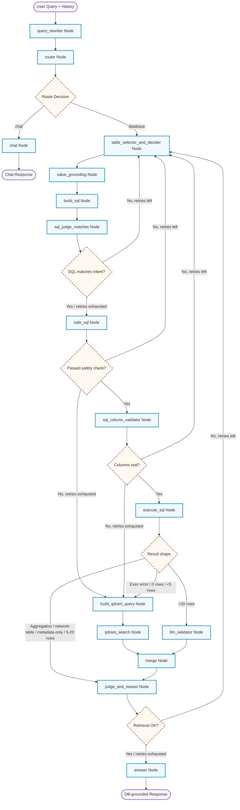
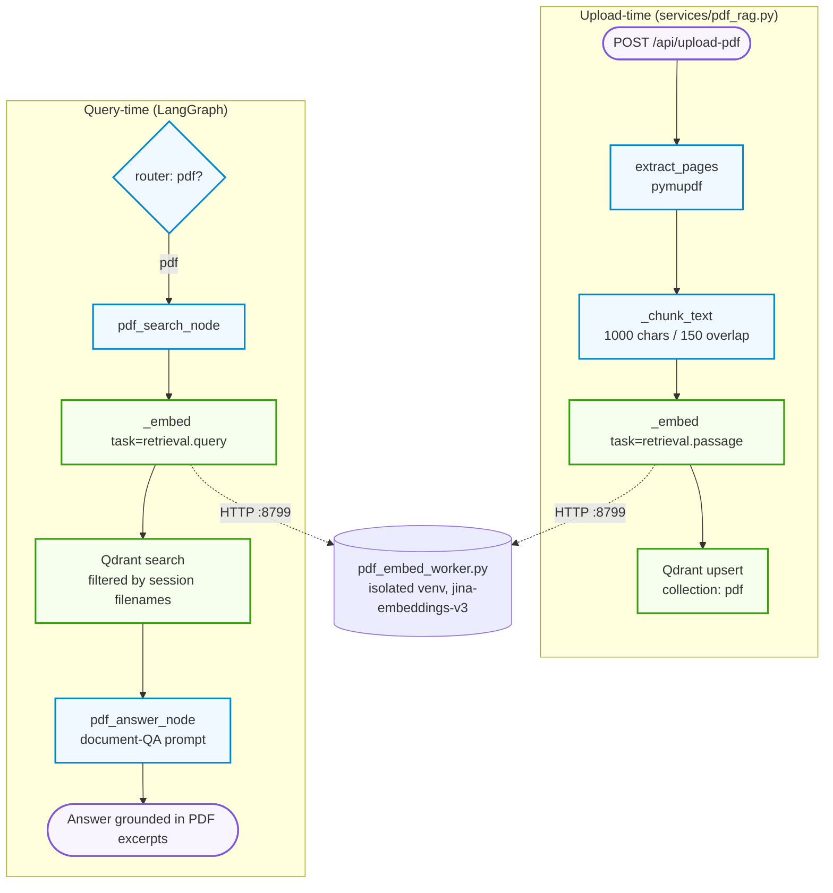

# Smart LangGraph + Qdrant + MySQL Agent

An advanced, production-grade agentic orchestration pipeline built with **LangGraph**, **Ollama (Qwen3-Coder)**, **Qdrant Vector Database**, and **MySQL**. It dynamically routes queries between general assistant conversation and complex relational database retrieval with fallback semantic/vector searches.

---

## 🏗️ Workflow Architecture

Below is the complete LangGraph `StateGraph` workflow implemented in [ollamaagent2.py](file:///Users/himanshuchauhan/Desktop/working/7%20Jul/personal-him/ollamaagent2.py) (graph build starts at [ollamaagent2.py:3670](file:///Users/himanshuchauhan/Desktop/working/7%20Jul/personal-him/ollamaagent2.py#L3670)).



Every retry-back edge into `table_selector_and_decider` is capped at 3 attempts (`retry_count`); once exhausted, the graph forces itself forward (to `safe_sql`, to the Qdrant fallback, or straight to `answer`) instead of looping forever. Any attempt abandoned via the Qdrant fallback after exhausting retries is also written to the MongoDB `agent_review_queue` collection ([flag_for_review](file:///Users/himanshuchauhan/Desktop/working/7%20Jul/personal-him/ollamaagent2.py#L99)) for human triage.

---

## 📝 Graph Nodes & Decision Logic

### 1. Query Rewriting & Routing
* **[query_rewriter_node](file:///Users/himanshuchauhan/Desktop/working/7%20Jul/personal-him/ollamaagent2.py#L1169)**: Entry point. Rewrites the latest user message into a standalone English/Hindi query pair using conversation history — resolves pronouns ("this", "that one"), normalizes implicit recency ("viral posts" → "viral posts recent of today"), and can short-circuit to a `CLARIFY:` question when a reference is ambiguous.
* **[router_node](file:///Users/himanshuchauhan/Desktop/working/7%20Jul/personal-him/ollamaagent2.py#L1506)**: Classifies the rewritten query as `chat` or `database` via the LLM.
  * **chat**: Routed to **[chat_node](file:///Users/himanshuchauhan/Desktop/working/7%20Jul/personal-him/ollamaagent2.py#L1558)**, which answers directly (or returns the `CLARIFY:` text) and finishes the graph.
  * **database**: Routed to **[table_selector_and_decider_node](file:///Users/himanshuchauhan/Desktop/working/7%20Jul/personal-him/ollamaagent2.py#L1587)** to start the SQL extraction flow.

### 2. SQL Planning & Generation
* **[table_selector_and_decider_node](file:///Users/himanshuchauhan/Desktop/working/7%20Jul/personal-him/ollamaagent2.py#L1587)**: Picks the minimum set of tables (from the 20-table `SCHEMA_TABLE_NAMES` allowlist) needed to answer the query, using the full `DB_SCHEMA_YAML` doc and any feedback from a previous failed attempt (`sql_match_reason` / `sql_fail_reason`). Increments `retry_count` on every pass — this is the shared re-entry point for every failure branch in the graph.
* **[value_grounding_node](file:///Users/himanshuchauhan/Desktop/working/7%20Jul/personal-him/ollamaagent2.py#L812)**: For closed-set concepts relevant to the selected tables (category, platform, district, connection type), deterministically matches phrases in the query against real cached DB values (`GROUNDING_GROUPS`, 15-minute TTL cache) — no LLM guessing, so `build_sql` gets DB-confirmed literal values instead of hallucinated ones.
* **[build_sql_node](file:///Users/himanshuchauhan/Desktop/working/7%20Jul/personal-him/ollamaagent2.py#L1903)**: Generates the MySQL `SELECT` statement against the selected tables, incorporating grounded values and prior-turn entity context.
* **[sql_judge_matches_node](file:///Users/himanshuchauhan/Desktop/working/7%20Jul/personal-him/ollamaagent2.py#L2440)**: LLM double-check that the generated SQL actually answers the user's intent. On mismatch, loops back to `table_selector_and_decider` (up to 3 retries, then forces through anyway).
* **[safe_sql_node](file:///Users/himanshuchauhan/Desktop/working/7%20Jul/personal-him/ollamaagent2.py#L2534)** / **[check_sql_safety](file:///Users/himanshuchauhan/Desktop/working/7%20Jul/personal-him/ollamaagent2.py#L1023)**: Hard programmatic gate — must be a single `SELECT`, only allowlisted tables, no forbidden keywords (`DELETE`, `DROP`, `UPDATE`, …), and no PII/secret columns (`password`, `phone`, `otp`, …). A query that fails is **never** executed; after 3 retries it falls back to the Qdrant pipeline instead.
* **[sql_column_validator_node](file:///Users/himanshuchauhan/Desktop/working/7%20Jul/personal-him/ollamaagent2.py#L948)** / **[validate_sql_columns](file:///Users/himanshuchauhan/Desktop/working/7%20Jul/personal-him/ollamaagent2.py#L889)**: Parses the SQL with `sqlglot` and verifies every table/column reference exists in the curated schema (`CURATED_SCHEMA_COLUMNS`, parsed straight out of `DB_SCHEMA_YAML`) — a deterministic hard gate against hallucinated columns, complementing the LLM-based `sql_judge_matches` check. Degrades to a no-op if `sqlglot` isn't installed.

### 3. Execution & Dynamic Data Routing
* **[execute_sql_node](file:///Users/himanshuchauhan/Desktop/working/7%20Jul/personal-him/ollamaagent2.py#L2659)**: Runs the validated query against MySQL and decides the next node from the result shape:
  * **Execution error, 0 rows, or < 5 rows**: Too little relational signal — falls back to the **Qdrant pipeline** (`build_qdrant_query` → `qdrant_search`) for semantic vector matches.
  * **Aggregation query** (`COUNT`/`SUM`/`GROUP BY`), a **network/engagement table** (retweets, replies, connections, comments — see `NETWORK_TABLES`), or a **metadata-only** result (no `input_text` column): routed straight to **[judge_and_reason_node](file:///Users/himanshuchauhan/Desktop/working/7%20Jul/personal-him/ollamaagent2.py#L3152)**, bypassing the Qdrant fallback since these result classes are legitimately sparse or Qdrant can't answer them anyway.
  * **5–20 rows**: Standard optimal context size — also routes to `judge_and_reason`.
  * **> 20 rows**: Too much content for one prompt — routed to **[llm_validator_node](file:///Users/himanshuchauhan/Desktop/working/7%20Jul/personal-him/ollamaagent2.py#L2775)** to filter down to the relevant rows first.

### 4. Merging & Final Review
* **[build_qdrant_query_node](file:///Users/himanshuchauhan/Desktop/working/7%20Jul/personal-him/ollamaagent2.py#L3000)** / **[qdrant_search_node](file:///Users/himanshuchauhan/Desktop/working/7%20Jul/personal-him/ollamaagent2.py#L3089)**: Builds an embedding query and searches the `topic_vector_v10` Qdrant collection for semantically similar topics as a fallback/supplement to SQL.
* **[merge_node](file:///Users/himanshuchauhan/Desktop/working/7%20Jul/personal-him/ollamaagent2.py#L3128)**: Harmonizes validated SQL context and Qdrant results into one merged context block.
* **[judge_and_reason_node](file:///Users/himanshuchauhan/Desktop/working/7%20Jul/personal-him/ollamaagent2.py#L3152)**: Determines whether the accumulated context actually answers the user's query (`retrieval_ok`), bypassing the LLM check entirely for aggregation-class results. If not satisfied and retries remain, loops back to `table_selector_and_decider`.
* **[answer_node](file:///Users/himanshuchauhan/Desktop/working/7%20Jul/personal-him/ollamaagent2.py#L3264)**: Formulates the final natural-language response to the user and finishes the graph.

---

## 📄 PDF RAG Workflow

A separate, session-scoped retrieval pipeline lets a user upload a PDF and ask questions about its content. It plugs into the main graph as a third router branch (`"pdf"`, offered by [router_node](file:///Users/himanshuchauhan/Desktop/working/7%20Jul/personal-him/ollamaagent2.py#L1512) only once a PDF has been uploaded this session) but otherwise runs independently of the SQL/Qdrant pipeline above — no `table_selector`, no `safe_sql`, no MySQL involved.



### Ingestion (upload time)
* **[/api/upload-pdf](file:///Users/himanshuchauhan/Desktop/working/7%20Jul/personal-him/server.py#L79)**: FastAPI endpoint in [server.py](file:///Users/himanshuchauhan/Desktop/working/7%20Jul/personal-him/server.py). Accepts a `.pdf` file, calls `ingest_pdf`, then appends the filename to `session_pdf_filenames` (in-memory, cleared on session reset) so later queries are scoped to documents uploaded *this session* even though the Qdrant collection persists across sessions.
* **[extract_pages](file:///Users/himanshuchauhan/Desktop/working/7%20Jul/personal-him/services/pdf_rag.py#L99)**: Extracts raw text per page with `pymupdf` (`fitz`).
* **[_chunk_text](file:///Users/himanshuchauhan/Desktop/working/7%20Jul/personal-him/services/pdf_rag.py#L107)**: Splits each page into overlapping ~1000-character chunks (150-char overlap) so context isn't lost at chunk boundaries.
* **[ingest_pdf](file:///Users/himanshuchauhan/Desktop/working/7%20Jul/personal-him/services/pdf_rag.py#L124)**: Embeds every chunk (`task="retrieval.passage"`) and upserts each as a `PointStruct` — payload carries `text`, `filename`, `page`, `uploaded_at` — into the `pdf` Qdrant collection (created on first use, 1024-dim cosine).

### Retrieval (query time)
* **[pdf_search_node](file:///Users/himanshuchauhan/Desktop/working/7%20Jul/personal-him/ollamaagent2.py#L3602)**: Embeds the user's query (`task="retrieval.query"` — a different LoRA adapter than ingestion, required for jina-embeddings-v3 to retrieve well) and calls [search_pdf](file:///Users/himanshuchauhan/Desktop/working/7%20Jul/personal-him/services/pdf_rag.py#L155), which filters the Qdrant search to only the filenames uploaded in the current session.
* **[pdf_answer_node](file:///Users/himanshuchauhan/Desktop/working/7%20Jul/personal-him/ollamaagent2.py#L3618)**: Feeds the retrieved chunks into a plain document-QA prompt (deliberately *not* the `answer_node`'s "Police Intelligence Officer" persona, since it doesn't apply to arbitrary uploaded documents) and finishes the graph.

### Isolated embedding worker
Embedding computation cannot run in the main app's Python environment: [pdf_embed_worker.py](file:///Users/himanshuchauhan/Desktop/working/7%20Jul/personal-him/services/pdf_embed_worker.py) requires `numpy<2` + `torch==2.2.2` (the newest torch build available for this Intel Mac), which conflicts with the `transformers`/`sentence-transformers` versions the main app needs. So it runs as a **separate subprocess in its own `pdf_embed_env` venv**, exposing a tiny local FastAPI server (`/health`, `/embed`) on port `8799` that [services/pdf_rag.py](file:///Users/himanshuchauhan/Desktop/working/7%20Jul/personal-him/services/pdf_rag.py) talks to over HTTP instead of importing `torch`/`sentence-transformers` directly.
* **[load_embedding_model](file:///Users/himanshuchauhan/Desktop/working/7%20Jul/personal-him/services/pdf_rag.py#L44)**: Spawns the worker subprocess at server startup (mirrors `services/transcription.py`'s `load_whisper_model()`) and blocks until `/health` reports OK — first run downloads the ~2.3GB `jina-embeddings-v3` model. Logs to `worker.log`.
* **[stop_embedding_worker](file:///Users/himanshuchauhan/Desktop/working/7%20Jul/personal-him/services/pdf_rag.py#L80)**: Terminates the subprocess on app shutdown.

---

## 🗄️ Database Schemas & Infrastructure

### Relational Schema (MySQL)

```
                       +-----------------------------+
                       |            topic            |
                       +-----------------------------+
                       | id (INT)                    |
                       | unique_topic_id (VARCHAR)  <---+
                       | topic_title (VARCHAR)       |  |
                       | total_no_of_post (INT)      |  |
                       | primary_districts (JSON)    |  |
                       | sub_category (VARCHAR)      |  |
                       +-----------------------------+  |
                                                        |
                                                        |
         +-----------------------------+                |
         |        viral_alerts         |                |
         +-----------------------------+                |
         | id (INT)                    |                |
         | unique_topic_id (VARCHAR)  -+----------------+
         | type (VARCHAR)              |                |
         | topic_title (VARCHAR)       |                |
         | posts_5min (INT)            |                |
         | posts_10min (INT)           |                |
         | posts_1hour (INT)           |                |
         | primary_district (VARCHAR)  |                |
         | created_at (TIMESTAMP)      |                |
         +-----------------------------+                |
                                                        |
                                                        |
         +-----------------------------+                |
         |        analyzed_data        |                |
         +-----------------------------+                |
         | id (INT)                    |                |
         | unique_topic_id (VARCHAR)  -+----------------+
         | input_text (TEXT)           |
         | primary_district (VARCHAR)  |
         | primary_thana (VARCHAR)     |
         | primary_location (VARCHAR)  |
         | topic_title (VARCHAR)       |
         | created_at (TIMESTAMP)      |
         | sentiment_label (VARCHAR)   |
         | keywords_cloud (TEXT)       |
         | post_bank_post_url (VARCHAR)|
         | source_type (VARCHAR)       |
         +-----------------------------+
```

The full schema now spans **20 tables** (up from the original 3), defined as a single source of truth in [`DB_SCHEMA_YAML`](file:///Users/himanshuchauhan/Desktop/working/7%20Jul/personal-him/ollamaagent2.py#L144) and [`SCHEMA_TABLE_NAMES`](file:///Users/himanshuchauhan/Desktop/working/7%20Jul/personal-him/ollamaagent2.py#L478) — the same list drives the planner LLM's available-table menu, the `check_sql_safety` allowlist, and the `sqlglot` column validator, so they can never drift apart.

### Social Graph & Engagement Schema

Beyond the topic-level tables above, a second hub-and-spoke schema tracks *who posted what* and *who engaged with it*:

```mermaid
graph TD
    subgraph topicLevel [" Topic-Level (unique_topic_id) "]
        topic[topic]
        viral_alerts[viral_alerts]
        analyzed_data["analyzed_data<br/>(denormalized copy of post_bank —<br/>NO post_bank_id FK)"]
    end

    subgraph contentHub [" Content Hub "]
        post_bank["post_bank (pb)<br/>CENTRAL CONTENT KEY"]
    end

    subgraph actorHubs [" Actor Hubs "]
        post_users["post_users (pu)<br/>ACTOR HUB"]
        user_monitoring["user_monitoring (um)<br/>MONITORED ACTOR HUB"]
    end

    subgraph actorEdges [" Actor-to-Actor Edges "]
        profile_network["profile_network (pn)"]
        user_connections["user_connections (uc)"]
    end

    subgraph engagementEdges [" Post-to-Actor Engagement Edges (FK -> post_bank.id) "]
        pui["post_user_interactions (pui)"]
        pue["post_user_engagement (pue)"]
        retweet["retweet (rt)"]
        reply["reply (rp)"]
        fb_comments["fb_comments (fc)"]
        insta_comments["insta_comments (ic)"]
        engagement_metric["engagement_metric (em)"]
    end

    subgraph taxonomy [" Taxonomy / Lookup "]
        broad_category["broad_category (bc)"]
        sub_category["sub_category (sc)"]
        keywords["keywords (kw)"]
        hashtags["hashtags (ht)"]
        chm["category_handle_master (chm)"]
        monitor_profiles["monitor_profiles (mp)"]
    end

    topic -. unique_topic_id .-> viral_alerts
    topic -. unique_topic_id .-> analyzed_data

    post_bank -->|post_bank_id| pui
    post_bank -->|post_bank_id| pue
    post_bank -->|post_bank_id| retweet
    post_bank -->|post_bank_id| reply
    post_bank -->|post_bank_id| fb_comments
    post_bank -->|post_bank_id| insta_comments
    post_bank -->|post_bank_id| engagement_metric

    post_users -->|post_user_id| pui
    post_users -->|post_user_id| pue
    post_users -->|post_user_id| retweet
    post_users -->|post_user_id| reply
    post_users -->|user_id / follower_id| profile_network

    user_monitoring -->|source_user_id / target_user_id| user_connections

    sub_category -->|broad_category_id| broad_category
    keywords -->|broad_category_id| broad_category
    keywords -->|sub_category_id| sub_category
```



### Table-by-Table Breakdown & Purpose

#### Topic-Level Tables (joined via `unique_topic_id`)
| Table | Purpose | Key Columns | Use Case |
|---|---|---|---|
| `topic` | High-level categorization, metadata, and summary for each unique topic/event | `topic_title`, `total_no_of_post`, `primary_districts` (JSON, first element = primary), `sub_category`, `created_at` | Topics, incidents, categories, summaries, statistics, aggregates |
| `viral_alerts` | Recently trending / rapidly growing topics detected by the system | `posts_5min`, `posts_10min`, `posts_1hour`, `primary_district`, `created_at` | Trending, viral, breaking, currently-significant events |
| `analyzed_data` | Individual social media posts and their metadata — a denormalized **copy** of `post_bank` rows | `input_text`, `primary_district`, `primary_thana`, `sentiment_label`, `keywords_cloud`, `post_bank_post_url`, `post_bank_core_source` | Post-level info: raw text, URLs, sources, authors, sentiment, thana/location |

#### Content & Actor Hubs
| Table | Alias | Purpose | Key Columns | Use Case |
|---|---|---|---|---|
| `post_bank` | `pb` | Canonical raw post record — the CENTRAL CONTENT KEY every engagement table joins to via `post_bank_id` | `post_title`, `post_url`, `core_source`, `likes`, `retweets`, `comments`, `views`, `author_name` | JOIN anchor for "who engaged with this post" questions; raw post lookups by id/url/author |
| `post_users` | `pu` | Canonical identity for any social actor (author/retweeter/replier/commenter) — the ACTOR HUB | `platform`, `username`, `followers_count`, `is_verified`, `total_engagement` | Account/handle lookups, resolving a display name from a numeric id, actor endpoint of engagement/network questions |
| `user_monitoring` | `um` | Curated watchlisted/monitored actor registry, used specifically by `user_connections` | `username`, `category` (CASTE, COMMUNAL_TENSION, CRIME_AGAINST_WOMEN, …), `analysis_depth` | Monitored/watchlisted accounts and their typed relationships only — **not** general post authorship |

> `analyzed_data` is an enriched **copy** of `post_bank` rows and carries no `post_bank_id` FK — engagement tables must join to `post_bank`, never to `analyzed_data`.

#### Actor-to-Actor Edges
| Table | Alias | Purpose | Key Columns | Use Case |
|---|---|---|---|---|
| `profile_network` | `pn` | Follower/following edge between two ordinary `post_users` accounts | `user_id`, `follower_id`, `relationship_type`, `platform` | "Who follows X" / "who does X follow" for ordinary accounts |
| `user_connections` | `uc` | Typed, weighted edge between two `user_monitoring` actors | `source_user_id`, `target_user_id`, `connection_type` (FOLLOWER/FOLLOWING/MENTIONED/MUTUAL/REPLIED/RETWEETED), `connection_strength` | Who's connected to whom, connection type/strength between monitored accounts |

#### Post-to-Actor Engagement Edges (all FK → `post_bank.id`)
| Table | Alias | Purpose | Use Case |
|---|---|---|---|
| `post_user_interactions` | `pui` | Generic interaction log (like/retweet/quote/reply/bookmark) linking an actor to a post | Any single interaction-type question answerable from one table |
| `post_user_engagement` | `pue` | Platform-typed engagement with subtype + numeric value | Engagement broken down by type/subtype with a value, not just an event log |
| `retweet` | `rt` | Each retweet of a post, with the retweeter's profile snapshot | "Who retweeted X", influential retweeters ranked by follower count |
| `reply` | `rp` | Replies to a post, with reply text and replier identity | "Who replied to X", reply content/sentiment/volume |
| `fb_comments` | `fc` | Facebook comments on a post | Facebook comment-level questions |
| `insta_comments` | `ic` | Instagram comments on a post | Instagram comment-level questions |
| `engagement_metric` | `em` | Pre-aggregated likes/comments/shares/views/reach totals | "Most engaged/liked/shared post" — cheaper than summing raw edge tables |

#### Taxonomy / Lookup Tables
| Table | Alias | Purpose |
|---|---|---|
| `broad_category` | `bc` | Top-level category taxonomy (CRIME, PROTEST, ACCIDENT, …) |
| `sub_category` | `sc` | Sub-category under a `broad_category` |
| `keywords` | `kw` | Keyword→category mapping (English/Hindi/Hinglish) used for classification |
| `hashtags` | `ht` | Monitored hashtag list with category/priority/vertical tagging |
| `category_handle_master` | `chm` | Master list of monitored handles mapped to a category |
| `monitor_profiles` | `mp` | Registry of monitored profiles across platforms with processing status |

### Relationship Keys
- **Content join key**: `topic.unique_topic_id = viral_alerts.unique_topic_id = analyzed_data.unique_topic_id`
- **Content hub**: `post_bank.id` → referenced as `post_bank_id` by `post_user_interactions`, `post_user_engagement`, `retweet`, `reply`, `fb_comments`, `insta_comments`, `engagement_metric`
- **Actor hub**: `post_users.id` → referenced as `post_user_id` by the engagement tables above, and as `user_id`/`follower_id` by `profile_network`
- **Monitoring actor hub**: `user_monitoring.id` → referenced as `source_user_id`/`target_user_id` by `user_connections`
- **Taxonomy joins**: `keywords.broad_category_id → broad_category.id`, `keywords.sub_category_id → sub_category.id`, `sub_category.broad_category_id → broad_category.id`

### Query Safety & Value Grounding
- **[FORBIDDEN_COLUMNS](file:///Users/himanshuchauhan/Desktop/working/7%20Jul/personal-him/ollamaagent2.py#L576)**: PII/secret columns (`password`, `phone`, `otp`, `auth_token`, …) are structurally blocked from any generated `SELECT`, regardless of table, as defense in depth beyond the schema doc's instructions to the LLM.
- **[GROUNDING_GROUPS](file:///Users/himanshuchauhan/Desktop/working/7%20Jul/personal-him/ollamaagent2.py#L612)**: closed-set concepts (`category`, `platform`, `district`, `connection_type`) are matched deterministically against real, cached DB values before SQL generation — see `value_grounding_node` in the workflow above.

### Logging & Auditing
- **MongoDB**: `sql_history` records generated SQL, schemas used, and run-time errors; `agent_review_queue` collects queries where the pipeline exhausted all retries and fell back to semantic search, for analyst triage ([flag_for_review](file:///Users/himanshuchauhan/Desktop/working/7%20Jul/personal-him/ollamaagent2.py#L99)).
- **Trace Collector**: Thread-safe in-memory execution logger (`_trace_log`) tracks state changes and outputs node-by-node, enabling easy developer diagnostics.

---

## 🛠️ Configuration Variables
You can update variables directly in [ollamaagent2.py](file:///Users/himanshuchauhan/Desktop/working/7%20Jul/personal-him/ollamaagent2.py#L50-L86):

- **Ollama API URL & Model**: `OLLAMA_URL` and `MODEL_NAME`
- **Qdrant Host, Port, & Collection**: `QDRANT_HOST`, `QDRANT_PORT`, and `COLLECTION`
- **MySQL Host, Credentials, & Database**: `MYSQL_HOST`, `MYSQL_PORT`, `MYSQL_USER`, `MYSQL_PASSWORD`, and `MYSQL_DB`
- **MongoDB Connection URI**: `MONGO_URI`


https://app.liveavatar.com/

uvicorn pdf_embed_worker:app --host 127.0.0.1 --port 8799